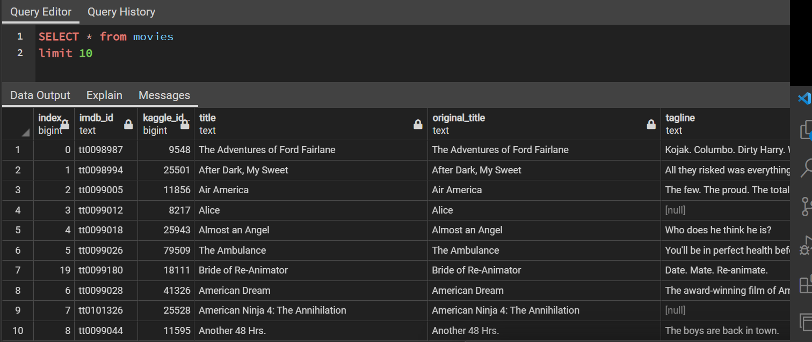
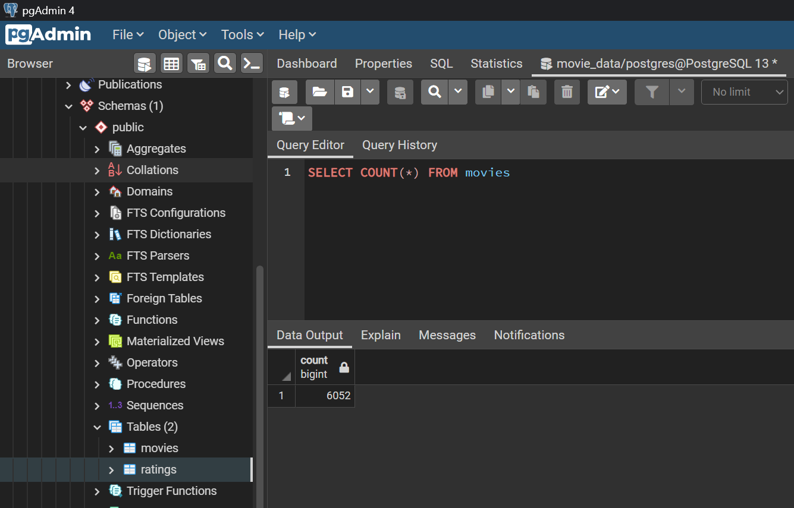
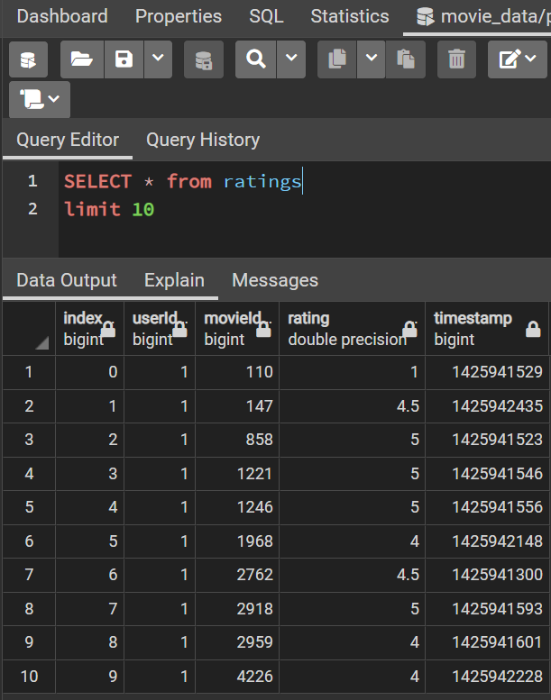
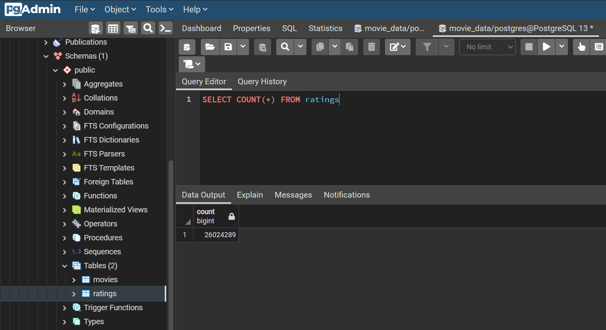

# Movies-ETL

## Project Overview

### In this module we learned about the data pipeline process known as ETL, or Extract, Transform, and Load.
### Our goal in this project is to assist Amazing Prime, during a Hackathon, to create an automated pipeline that takes in new data information from few databases, Wikipedia data, Kaggle metadata and the MoviLens rating data. The process will then complete appropriate transformations to ensure the data is consistent and also to maintain its integrity. Once this portion of the process is complete, the final data collected will be loaded into a PostgreSQL database.

### In order to achieve the above goal, we:

* Created an ETL function to read three data files.
* Extracted data from the above three sources.
* Cleaned and Transformed the data collected.
* Loaded the data with PostgreSQL into a Movie Database, that included 2 tables, a movies table and a ratings table.

### The ETL process we followed in this analysis helped us collect and clean movie data from different sources and different files' types, "JSON" & "csv" ). We transformed and merged the data collected and we were able to load it using PostgreSQL into a database, named Movie_data, that included two tables displaying all cleaned and ready to use information for all the hackathon participants. 

### The images below display a portion of the infomation each table provides, as well as the total number of rows in each table.

* Movies Table

* Movies Query

* Ratings Table

                

* Ratings Query

